# Codex Shark Captain Pet

這是一個獨立於 Rune 與 Rook 的 Codex v2 動畫寵物專案。主角 **Reef** 是成熟、壯碩、沉著又可靠的藍色虎鯊獸人船長。

<p align="center">
  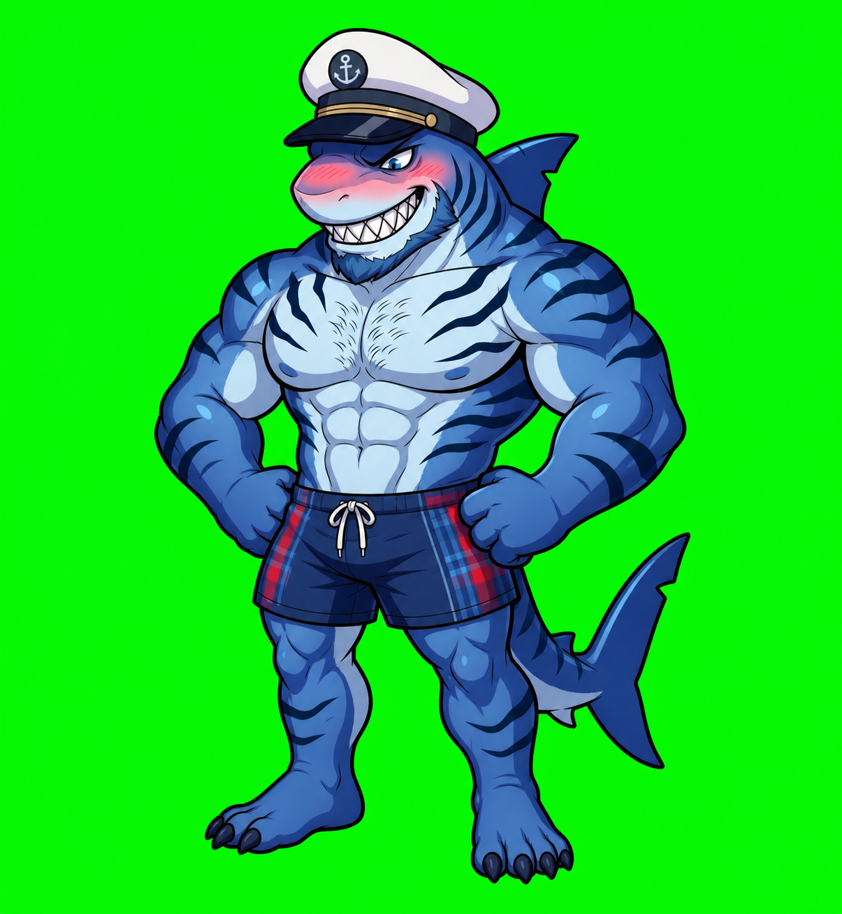
</p>

## 視覺方向

- 白色船長帽、深藍帽簷與黃銅飾帶。
- 深藍虎鯊條紋、淺藍胸腹、背鰭與厚實尾鰭。
- 裸露結實上半身，搭配深藍甲板短褲及低調紅藍格紋。
- 乾淨的 2D cel-shaded 插畫、清楚深色輪廓、冷海洋藍配色。
- 使用相連的船舵、纜繩與望遠鏡表達航海，不使用整艘船或海景背景。

## 動畫規劃

| Codex 狀態 | Reef 的水手動作 |
| --- | --- |
| idle | 穩健海腳站姿、呼吸、眨眼、尾鰭輕擺 |
| running-right / left | 抱著繩圈在甲板方向移動 |
| waving | 船長敬禮後揮手 |
| jumping | 模擬船身起伏的收身甲板跳 |
| failed | 船舵卡住，出力後洩氣 |
| waiting | 抱著繫纜等待下一道命令 |
| running | 雙手交替轉動船舵、專注航行 |
| review | 用黃銅望遠鏡巡視地平線 |

最終資產採 Codex v2 規格：`8 × 11`、每格 `192 × 208`，總尺寸 `1536 × 2288`，並包含完整 16 向視線循環。

## 標準動畫預覽

<table>
  <tr><th>待機</th><th>抱繩向右</th><th>抱繩向左</th></tr>
  <tr>
    <td>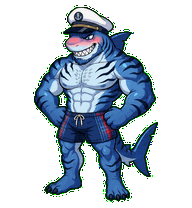</td>
    <td>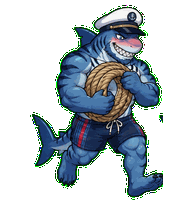</td>
    <td>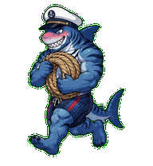</td>
  </tr>
  <tr><th>敬禮揮手</th><th>甲板跳</th><th>船舵卡住</th></tr>
  <tr>
    <td>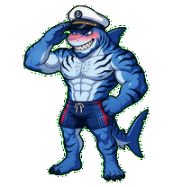</td>
    <td>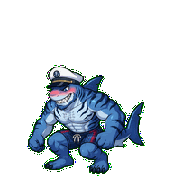</td>
    <td>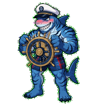</td>
  </tr>
  <tr><th>抱纜待命</th><th>轉舵航行</th><th>望遠鏡巡視</th></tr>
  <tr>
    <td>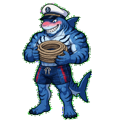</td>
    <td>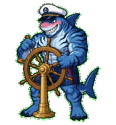</td>
    <td>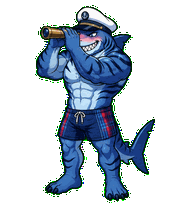</td>
  </tr>
</table>

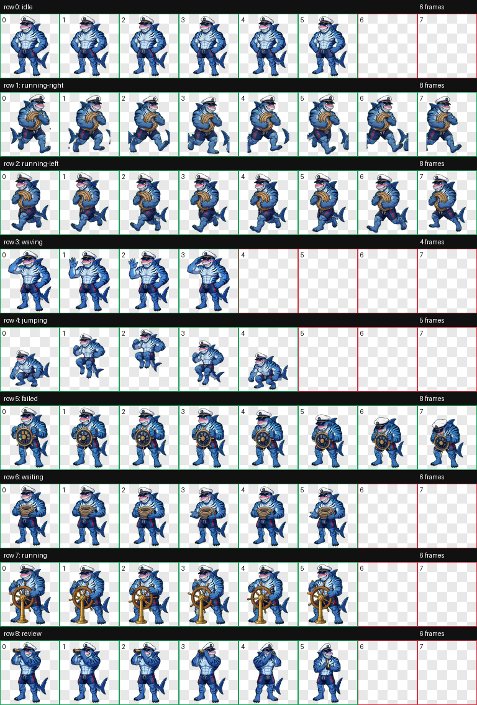

## 512 × 512 上傳版

`docs/assets/upload-ready-512/` 提供一套正方形高解析動畫。每個動作都補上終點停頓與回復起始姿勢的循環段落，並符合以下限制：

- GIF 格式、透明背景、512 × 512 像素。
- 7–15 幀，不超過 60 幀。
- 每個檔案小於 1 MB。

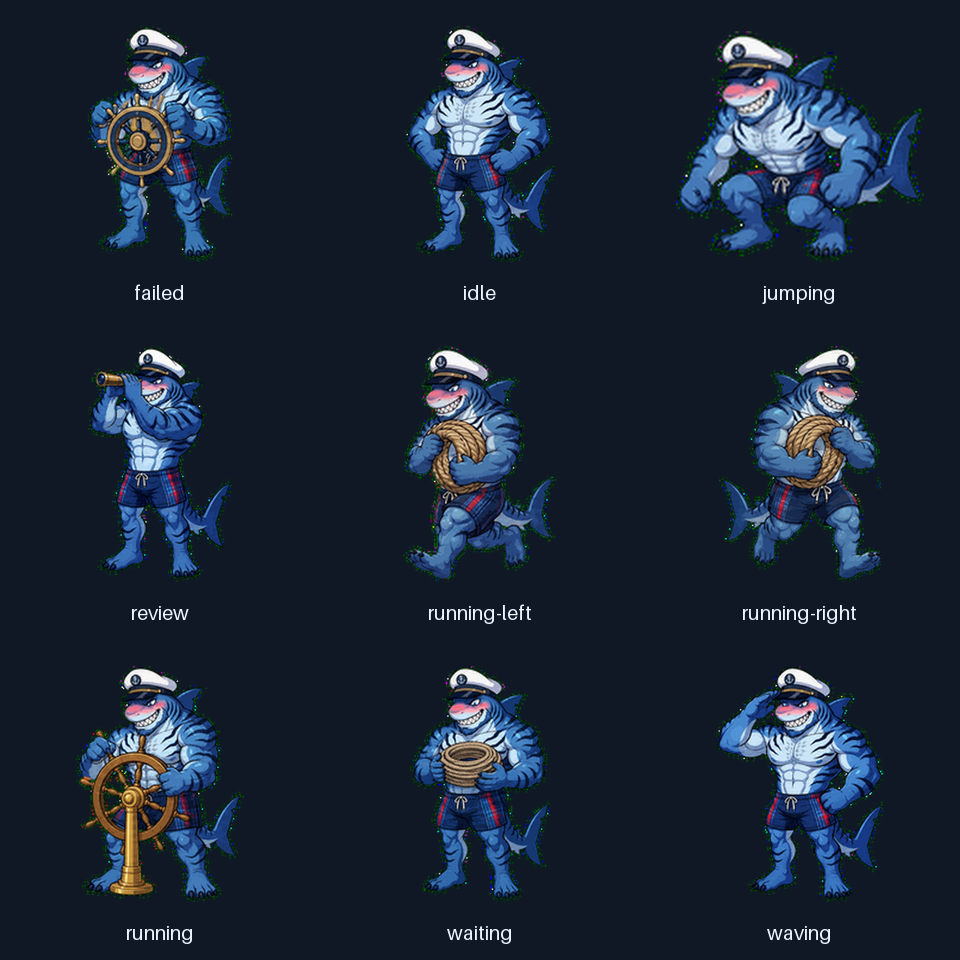

## 512 × 512 Reaction 動畫包

`docs/assets/reactions-512/` 收錄十組白底 reaction GIF、瀏覽頁、接觸表與可直接取用的 ZIP 壓縮包。每組動畫均為 512 × 512、無限循環，且單檔小於 1 MB。

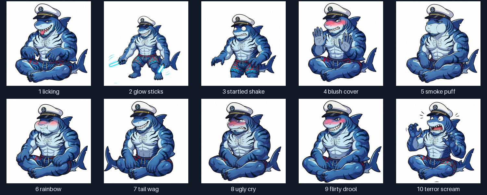

- [開啟 reaction 瀏覽頁](docs/assets/reactions-512/index.html)
- [取得完整 ZIP 動畫包](docs/assets/reactions-512/reef-reactions-512.zip)

如需從 `reaction-run/spritesheets/` 重新產生 GIF、接觸表、manifest 與 ZIP：

```bash
python3 scripts/build_reaction_gifs.py
```

## 安裝

可安裝套件位於 [`dist/reef/`](dist/reef/)：

```bash
mkdir -p ~/.codex/pets/reef
cp dist/reef/pet.json dist/reef/spritesheet.webp ~/.codex/pets/reef/
```

回到 Codex 桌面版的 **Settings → Pets**，按 **Refresh** 後選擇 Reef，再輸入 `/pet` 喚醒。

如需重新產生 512 × 512 上傳版：

```bash
python3 -m pip install -r requirements.txt
python3 scripts/build_upload_ready_gifs.py
```

九列標準 GIF 也可組成 `8 × 9` 中間 atlas，預設輸出至 `build/reef-standard/`，不會覆寫 `dist/reef/` 的 v2 發布套件：

```bash
python3 scripts/build_standard_atlas.py
```

這個中間 atlas 只供檢查 rows 0–8；可安裝的 v2 套件仍須包含 rows 9–10 的 16 向視線並通過完整 QA。

## 目前狀態

- 主造型與九列標準動畫已完成 deterministic frame validation 與視覺 QA。
- `dist/reef/spritesheet.webp` 已通過尺寸、透明格、alpha channel 與透明 RGB residue 驗證。
- Reef 已封裝為本機 Codex Pet；互動技能則由 `codex-shark-captain-pet` plugin 提供。

角色與動作規格位於 [`docs/character-design.md`](docs/character-design.md) 與 [`docs/animation-plan.md`](docs/animation-plan.md)。原始參考圖保存在 `references/source/`。
